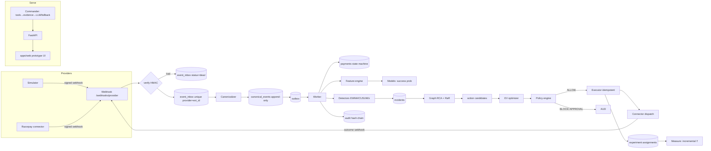

# Architecture

## Pattern
**Modular monolith + event-driven worker + ML library boundary.** No premature
microservices; every module boundary is extractable (ADR-001).

## Topology (development)
```
docker compose:  postgres:16 (:5433)   redis:8 (:6380)
make api         uvicorn paytwin_api.main:app      (:8000)  REST + SSE + serves apps/web
make worker      python -m paytwin_api.worker       (pipeline consumer, detectors, executor)
make demo        python -m paytwin_sim.demo        (seed + history + flagship scenario + train)
```

## Module map
| Module (package) | Responsibility | Emits | Consumes |
|---|---|---|---|
| `paytwin_contracts` | Canonical schemas, enums, money, versions | — | — |
| `paytwin_sim` | Seeded world gen, incident injection, webhook emission, ground truth | raw webhook payloads | — |
| `paytwin_ml` | Features, training, metrics, detectors, graph RCA, RaR, twin, uplift, LinUCB | predictions/scores (lib) | events via read models |
| `paytwin_api` | REST/SSE, authn/z, policy engine, optimizer, executor, audit, commander, worker | API events, actions, audit | canonical events, outbox |
| `apps/web` | The prototype UI (unchanged look), API-bound data layer | user intents | REST + SSE |

## Event flow


## Checkpoint-1 answers (explicit)
- **Events enter** via `POST /webhooks/{provider}` (HMAC) or simulator emitter; also admin replay.
- **Stored** raw in `event_inbox` (idempotent), canonicalized into append-only `canonical_events`.
- **Features**: worker computes point-in-time rolling aggregates from `canonical_events`/`payments`.
- **Models**: feature vector → registry-loaded model → `predictions` (with feature/model versions).
- **Incidents**: detector ensemble breaches (sustained windows) → correlate by cohort+time → one incident.
- **RCA**: heterogeneous attribution + counterfactual mask → ranked causes w/ confidence.
- **Candidates**: twin scenarios × cohort → action candidates w/ predicted distributions.
- **Simulations**: seeded Monte-Carlo per candidate (p50/lo/hi, trajectory, cost).
- **Policies**: deterministic predicate evaluation → ALLOW / REQUIRE_APPROVAL / BLOCK (+failed rules).
- **Execution**: idempotency-keyed, state machine, outbox → connector; outcomes return as webhooks.
- **Feedback**: outcomes join experiment assignments → incremental lift + CI; calibration/drift monitors.
- **AI explains**: commander calls read-only tenant-scoped tools, builds evidence pack, cites ids.
- **Tenant isolation**: org/merchant columns everywhere; principal-scoped queries; tests prove denial.
- **Scale path**: worker sharding by merchant, outbox→Kafka swap, rollups→ClickHouse, cells (docs only).

## Extractable boundaries
`EventBus` (outbox now, Kafka later) · `Connector` protocol · `ModelBackend` protocol ·
`LlmProvider` protocol (none|openai|anthropic) · `Cache` (redis|in-memory).
