# PayTwin OS Architecture

```mermaid
flowchart LR
    A[Local provider-shaped events] --> B[HMAC verification and durable inbox]
    B --> C[Canonical payment state machine]
    C --> D[Merchant-cohort features]
    D --> E[Detection and graph RCA]
    E --> F[Revenue-at-risk interval]
    C --> G[Validated success model]
    G --> H[Versioned predictions per failed payment]
    F --> I[Seeded recovery twin]
    H --> J[Candidate ranking]
    I --> J
    J --> K[Deterministic policy and approval gates]
    K --> L[Idempotent local execution]
    L --> M[Treatment/control outcomes]
    M --> N[Hash-chained audit and recovery report]
```

## Decision boundary

The ML model produces a versioned success-propensity score for each failed
payment in an incident cohort. Candidate EV combines the twin's bounded
intervention estimate with that score. This remains an evidence input, not an
execution authority. The deterministic policy engine checks consent, time
windows, exposure caps, provider health, approval requirements, idempotency,
and stopping rules before an action can proceed.

## Runtime model flow

1. The local demo trains LogisticRegression and HistGradientBoosting
   candidates with time-separated fit, calibration, and holdout slices.
2. The best candidate is isotonic-calibrated and persisted as a model version.
3. The demo marks it VALIDATED only when the documented synthetic holdout
   acceptance gates pass. CHAMPION remains a role-gated promotion.
4. Incident processing loads only VALIDATED or CHAMPION artifacts, scores
   failed cohort payments, records Prediction rows, and stores model provenance
   on every resulting candidate.
5. If an artifact is unavailable or scoring fails, the system records an
   explicit unavailable state rather than claiming a model score.

## Deployment boundary

The repository supports SQLite for a portable demo/test path and a
PostgreSQL/Redis composition for local development. No live PSP credential,
real money movement, or merchant data is required for the Buildathon path.
